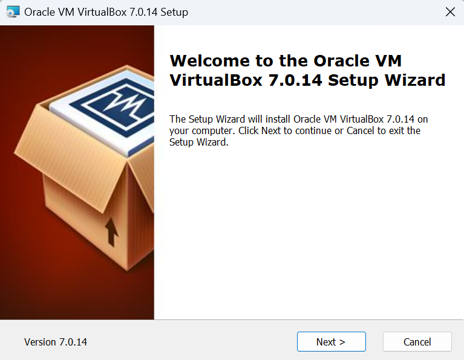

# SET UP DEBIAN

1. Siapkan Oracle VM VirtualBox, kemudian pilih 'New'
   

2. Masukkan nama dan file iso debian di ISO Image
   

3. Atur Base Memory dan CPU yang dibutuhkan
   

4. Atur penyimpanan sesuai yang dibutuhkan
   

5. Summary berisi detail OS yang di atur sebelumnya, kemudian finish
    

6. Tampilan awal set debian, pilih bahasa yg akan digunakan
    

7. Pilih lokasi
    

8. Set keyboard
    

9. Masukkan hostname (SysAdmin-NRP)
    

10. Nama domain kosong/default
    

11. Masukkan password
    

12. Masukkan username
    

13. Atur waktu
    

14. Atur partisi hard disk, pilih manual
    

15. Set bagian vbox harddisk
    

16. Pilih Ya
    

17. Partisi yang selesai dibuat
    

18. Pilih kobo.pens.ac.id untuk mengatur pengelola paket
    

19. Kosongkan alamat http
    

20. Pasang boot loader GRUB dan pilih hardisk yang sebelumnya
    

21. Selesai Instalasi

22. Tampilan Debian
    

# Perbedaan Debian 12 (Bookworm) dan Debian 11 (Bullseye)

# Fungsi dari File "/etc/group" dan Formatnya
File "/etc/group" berisi informasi tentang grup-grup pengguna pada sistem. Setiap baris mewakili satu grup dan memiliki format sebagai berikut:

nama_grup:password:ID_grup:anggota1,anggota2,...

- nama_grup: Nama grup.
- password: Biasanya berisi "x", dan sebenarnya password grup disimpan di "/etc/gshadow".
- ID_grup: ID numerik unik untuk grup.

#  Perbedaan antara "su" dan "su -"

- su: Mengganti pengguna tanpa mengganti lingkungan shell. Variabel lingkungan, seperti PATH, tetap dari pengguna sebelumnya.
- su -: Mengganti pengguna dan juga mengganti ke lingkungan shell yang baru. Ini sama dengan login sebagai pengguna tersebut dan membawa seluruh lingkungan pengguna tersebut.

# Fungsi dari "sudo"

"sudo" (superuser do) adalah perintah yang memungkinkan pengguna untuk menjalankan perintah sebagai pengguna lain, biasanya sebagai superuser (root). Ini memberikan hak akses terbatas dan terkontrol kepada pengguna, yang dicatat dan dilacak.

#  Langkah-langkah penambahan user sebagai user sudo

- Gunakan perintah su - untuk masuk sebagai root.
- Setelah masuk sebagai root, jalankan perintah visudo untuk mengedit file konfigurasi sudoers.
- Tambahkan baris berikut di bawah baris yang mencakup user root pada bagian " # User privilege specification":
  * username ALL=(ALL:ALL) ALL
  * (Gantilah "username" dengan nama pengguna yang ingin User tambahkan.)
- Simpan dan keluar dari editor.

Dengan langkah-langkah ini, pengguna yang User tambahkan akan memiliki hak akses sudo di sistem. Pastikan untuk memberikan hak akses sudo hanya kepada pengguna yang membutuhkannya dan amankan konfigurasi sudoers dengan hati-hati.
