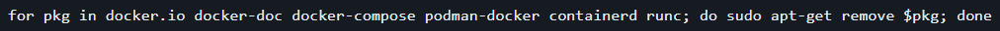
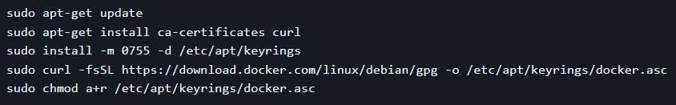
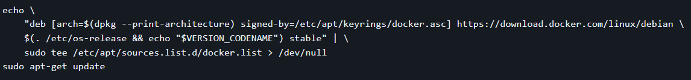
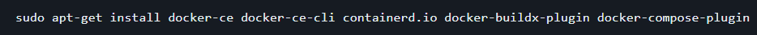
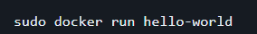
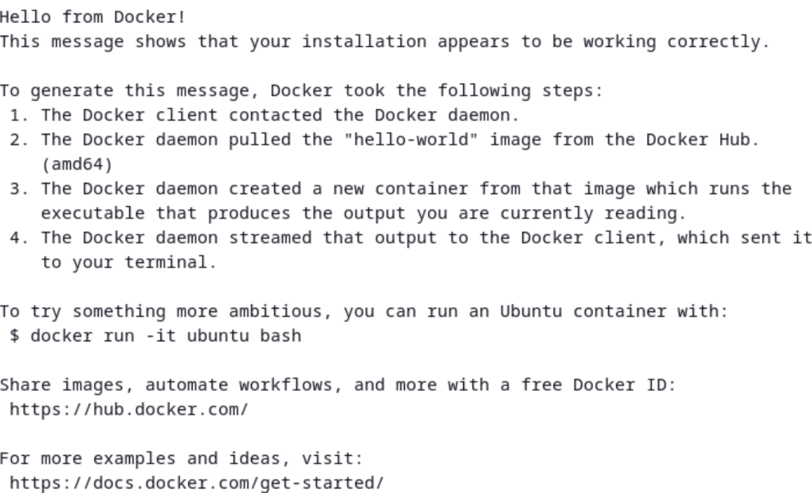
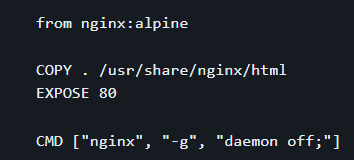
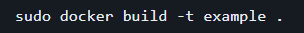
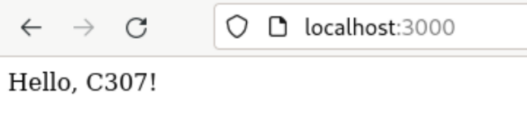

# Instalansi Docker Engine

Untuk langkah-langkah menginstall docker adalah sebagai berikut, atau anda juga dapat membuka melalui Docker Docs

1. Uninstall terlebih dahulu versi terdahulu docker yang sudah pernah terintall, maupun package yang mungkin menimbulkan konflik menggunakan

2. Siapkan repository dengan melakukan update serta menambahkan GPG key official Docker

3. Kemudian, tambahkan repository Apt sources

4. Install packege Docker-nya

5. Pastikan Docker sudah terinstall dengan sempurna, jalankan perintah di bawah ini

Jika sudah berhasil, maka akan muncul sebagai berikut

# Example

Kita akan membuat image sendiri yang akan kita beri nama example. Juga dapat digunakan langsung file dari github ini.

1. Pertama kita buat file dengan nama Dockerfile dengan isi sebagai berikut:

2. Buat file bernama index.html dengan sisi sebagai berikut: Hello, C307!

3. Jalanakan perintah berikut untuk membangun menjadi sebuah docker image. Pastikan anda berada di directory letak file Dockerfile dan index.html yang sudah anda buat. di sini kita beri nama container kita example

4. Jalankan Docker yang barusan dibuat menggunakan docker run sebagai berikut setelah proses build selesai "sudo docker run -p 3000:80"

5. Buka port 80 pada localhost anda melalui browser

