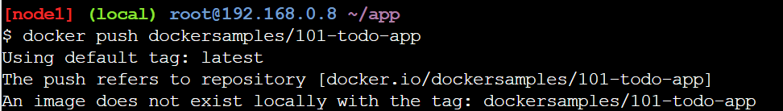

1. Login ke https://labs.play-with-docker.com/.
2. Klik add new instance. Akan ada terminal yang muncul.

3. Jalankan docker run -dp 80:80 docker/getting-started:pwd di terminalnya.

4. Setelah dijalankan, akan muncul port 80. Klik port tersebut.

5. Kita akan diarahkan ke port 80 yang kita jalankan tadi. Isinya adalah tutorial docker. Karena tadi di terminal, kita menggunakan image docker/getting-started. Di situ dijelaskan bagaimana cara kerja command yang dijalankan tadi.

# Our Application

1. Lalu pada sidebarnya, klik Our Application. Kita akan mengikuti langkah-langkah yang ada di situ. Di situ kita akan membuat website to-do-list yang berjalan di Node. Tapi di sini kita tidak membuat codingnya, karena source code sudah disediakan di http://ip172-18-0-38-cp5b4mgl2o9000ccij5g-80.direct.labs.play-with-docker.com/assets/app.zip.

2. Download app.zip dan drag-and-drop file tersebut ke terminal untuk mengupload filenya.

3. Extract filenya dengan unzip app.zip.

4. Navigasikan direktori ke app dan cek file apa saja yang ada di direktori tersebut. Bisa dilihat bahwa sudah ada folder dan file yang sesuai dengan aplikasi Node.

5. Buat file bernama Dockerfile dengan konten:

Jalankan touch Dockerfile untuk membuat filenya. Lalu ubah kontennya menggunakan vi atau cat, di sini saya menggunakan cat.

6. Build container imagenya dengan docker build -t docker-101 

7. Jalankan containernya dengan docker run -dp 3000:3000 docker-101. Di sini kita membuat map antara port 3000 milik host dan port 3000 milik container.

8. Klik port 3000 di atas dan kita berhasil membuat aplikasi to-do-list berbasis Node serta menjalankannya di container docker. 

# Updating Our App

1. Pada line 56 di ~/app/src/static/js/app.js. Ubah jadi seperti ini:

Kita bisa memanfaatkan Editor yang ada di Docker Playground untuk memudahkan edit file. Jangan lupa setelah mengubah, klik Save.

2. Lalu build versi terbaru dari imagenya dengan command yang sama docker build -t docker-101 ..

3. Jalankan container baru dengan code yang sudah diubah tadi docker run -dp 3000:3000 docker-101. Nah, akan ada error.

4. Cek ID containernya dengan docker ps.

5. Gunakan docker stop <container-id> untuk menghentikan container.

6. Sekarang kita bisa update app kita dengan docker run -dp 3000:3000 docker-101.

7. Klik port 3000 lalu kita bisa melihat perubahan yang kita buat tadi.

# Sharing Our App

1. Login dulu di https://hub.docker.com/.

2. Klik Create a Repository.

3. Repositorynya diberi nama 101-todo-app dan pastikan Visibilitynya di-set ke Public. Lalu klik Create. Di bagian kanan kita juga bisa melihat cara untuk push ke repo ini docker push algavania/101-todo-app:tagname.

4. Kembali ke PWD Instance atau terminal Dockernya dan jalankan docker push algavania/101-todo-app.

5. Ternyata terjadi error, untuk fix error tersebut maka kita harus memberikan tag ke image kita, atau memberi nama lain.

6. Login ke Docker Hub dengan command docker login -u YOUR-USER-NAME. Gunakan command docker tag untuk memberi nama baru kepada image docker-101.

7. Kita coba push image kita lagi dengan docker push algavania/101-todo-app dan ternyata berhasil.

8. Kembali ke PWD lalu klik "Add New Instance".

9. Lalu jalankan docker run -dp 3000:3000 YOUR-USER-NAME/101-todo-app.  

10. Buka port 3000 dan kita bisa melihat web to-do-list kita.

