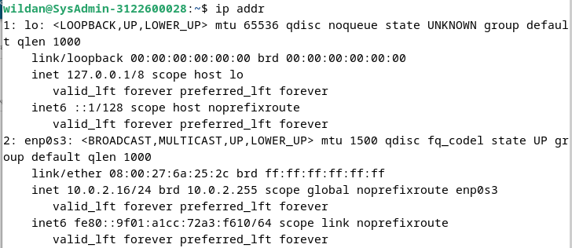
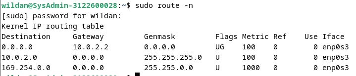
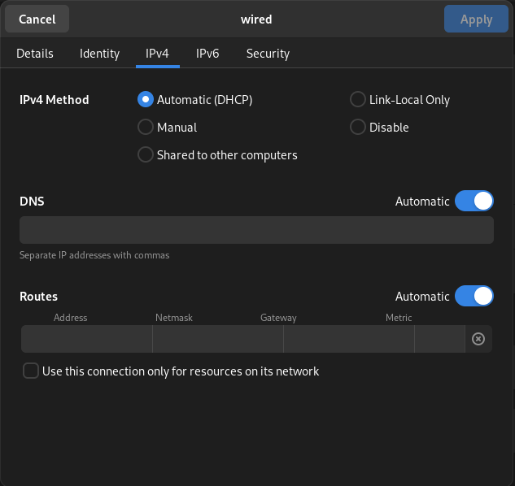
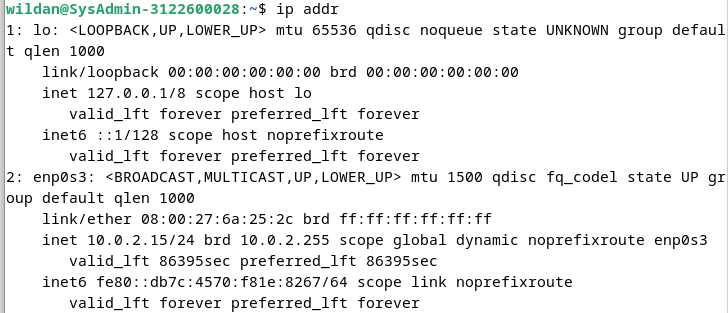

# DHCP to MANUAL

1. Langkah pertama : Melakukan checking ip address awal

2. Langkah kedua : Melakukan checking ip gateway

3. Langkah ketiga : Menambahkan profile network baru dengan konfigurasi seperti gambar

4. Langkah keempat : Melakukan checking ulang ip baru

