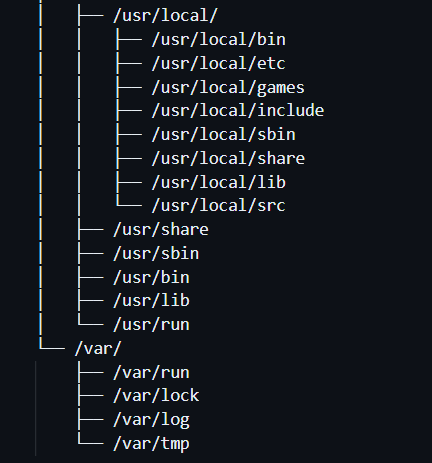

# Structure Directory Linux

Struktur Direktori dalam Unix & Linux adalah Struktur Direktori yang terpadu di mana semua direktori disatukan di bawah sistem file " / " Root. Terlepas dari di mana Sistem File secara fisik dipasang semua direktori disusun secara hierarkis di bawah sistem file Root.

Struktur Direktori Linux mengikuti "Struktur Hirarki Sistem File (FHS)" yang dikelola oleh Free Standards Group meskipun sebagian besar distribusi kadang-kadang cenderung menyimpang dari standar.

# Hierarki Struktur Direktori   
- "/" Root
Struktur Direktori dimulai dengan sistem file Root " / " dan memang merupakan direktori root untuk seluruh struktur tersebut. Partisi di mana / (direktori root) akan berada pada sistem UNIX atau kompatibel UNIX.

- /boot
Direktori /boot berisi file-boot loader termasuk Grub atau Lilo, Kernel, file konfigurasi initrd, dan system.map

- /sys
Ini berisi Kernel, Firmware, dan file-file terkait sistem.

- /sbin
Berisi Binari Sistem yang penting dan alat Administrasi Sistem yang penting untuk operasi dan kinerja sistem

- /bin
Berisi binari penting untuk pengguna dan utilitas-utilitas yang diperlukan dalam mode pengguna tunggal. Contoh, termasuk cat, ls, cp, dll.

- /lib
Berisi file library untuk semua binari yang disimpan di direktori /sbin & /bin

- /dev
Direktori /dev berisi file-file sistem penting dan driver.

- /etc
Direktori /etc/ berisi file konfigurasi Sistem penting termasuk /etc/hosts, /etc/resolv.conf, nsswitch.conf, defaults dan file konfigurasi jaringan. Ini sebagian besar adalah file konfigurasi sistem dan aplikasi yang spesifik untuk host.

- /home
Semua direktori home pengguna disimpan di bawah direktori ini kecuali direktori home root yang disimpan di bawah direktori /root. Direktori ini menyimpan file pengguna, pengaturan pribadi seperti .profile, dll.

- /media
Titik kait umum untuk media yang dapat dilepas seperti CD-ROM, USB, Floppies, dll

- /mnt
Titik kait umum untuk sistem file sementara. Ini sangat berguna terutama saat pemecahan masalah dari CDROM, dll di mana Anda mungkin harus memasang sistem file Root dan mengedit konfigurasi.

- /opt
Sebuah direktori yang jarang digunakan di Linux untuk Paket Perangkat Lunak Opsional. Ini digunakan secara luas di OS UNIX seperti Sun Solaris di mana paket-paket perangkat lunak diinstal

- /usr
Sub hirarki ke sistem file root yang merupakan direktori data Pengguna. Berisi utilitas dan aplikasi khusus pengguna. Anda akan melihat banyak sistem file penting tetapi tidak kritis dipasang di sini. Di sini Anda akan lagi menemukan direktori bin, sbin & lib yang berisi binari pengguna dan sistem non-kritis dan pustaka terkait dan direktori berbagi. Juga ditemukan di sini adalah direktori include dengan file include

- /usr/sbin
Berisi biner sistem non-esensial non-kritis dan utilitas jaringan

- /usr/bin
Berisi biner perintah non-esensial non-kritis untuk pengguna.

- /usr/lib
File library untuk biner di direktori /usr/bin & /usr/sbin.

- /usr/share
Sebuah direktori data bersama yang tidak tergantung pada platform

- /usr/local
Sub hirarki di bawah direktori /usr yang memiliki data Sistem Lokal termasuk biner pengguna dan sistem dan pustakanya

- /var
Direktori /var sebagian besar dipasang sebagai sistem file terpisah di bawah root di mana semua konten variabel seperti log, file spool untuk printer, crontab, pekerjaan, email, proses yang berjalan, file kunci, dll. Perlu diambil tindakan dalam merencanakan sistem file dan pemeliharaan ini karena ini dapat cepat terisi dan ketika FileSystem penuh dapat menyebabkan masalah operasional sistem dan aplikasi.

- /tmp
Sebuah sistem file sementara yang menyimpan file sementara yang dihapus saat sistem reboot. Ada juga direktori /var/tmp yang menyimpan file-file sementara juga. satu-satunya perbedaan antara keduanya adalah bahwa direktori /var/tmp menyimpan file yang dilindungi saat sistem reboot. Dengan kata lain, file /var/tmp tidak dihapus saat reboot.

Kemudian Anda memiliki sistem file virtual (psuedo) /proc yang berada di dalam memori dan dipasang di bawah Root yang menyimpan statistik kernel dan proses dalam format file teks.