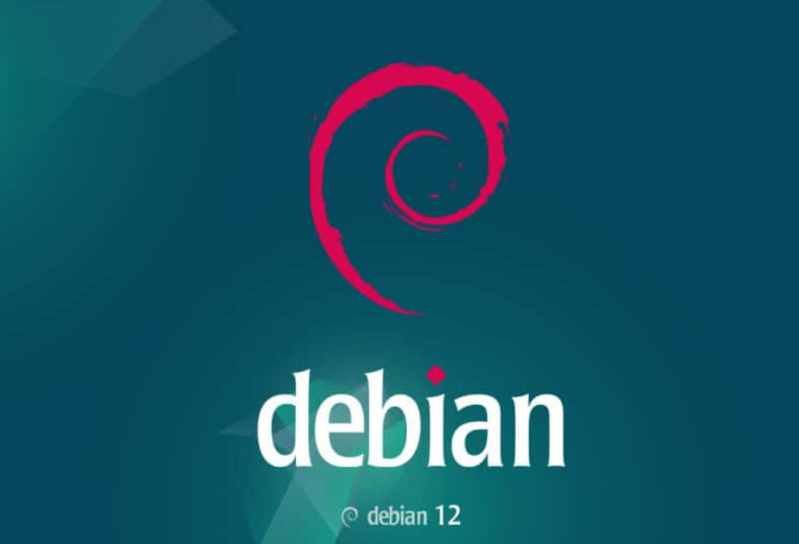

# Dasar System Debian
# About Debian 12
* Versi terbaru, Debian 12 (nama kode: "Bookworm"), menawarkan beragam pembaruan dan peningkatan performa.

# Dasar-dasar Administrasi
1. Manajemen Pengguna
* Debian 12 menyediakan utilitas seperti adduser dan deluser untuk manajemen pengguna.
* Untuk menambah pengguna baru, gunakan perintah: sudo adduser nama_pengguna.
* Untuk menghapus pengguna, gunakan: sudo deluser nama_pengguna.
2. Manajemen Paket
* APT (Advanced Package Tool) adalah manajer paket yang digunakan di Debian.
* Untuk menginstal paket baru, gunakan: sudo apt install nama_paket.
* Untuk menghapus paket, gunakan: sudo apt remove nama_paket.
3. Pembaruan System
* Untuk memperbarui daftar paket yang tersedia, jalankan: sudo apt update.
* Kemudian, untuk menginstal pembaruan yang tersedia: sudo apt upgrade.
4. Manajemen Layanan
* Layanan sistem dikontrol menggunakan perintah systemctl.
* Contoh, untuk memulai layanan: sudo systemctl start nama_layanan.
* Untuk menghentikan layanan: sudo systemctl stop nama_layanan.
5. Monitoring dan Loggin
* Debian 12 memiliki utilitas seperti top untuk memantau aktivitas sistem.
* Log sistem tersimpan di direktori /var/log.

# Kesimpulan
* Dengan menguasai manajemen pengguna, paket, layanan, serta monitoring dan logging, Anda dapat menjaga sistem Debian 12 Anda berjalan dengan lancar.