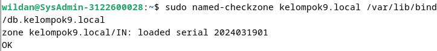
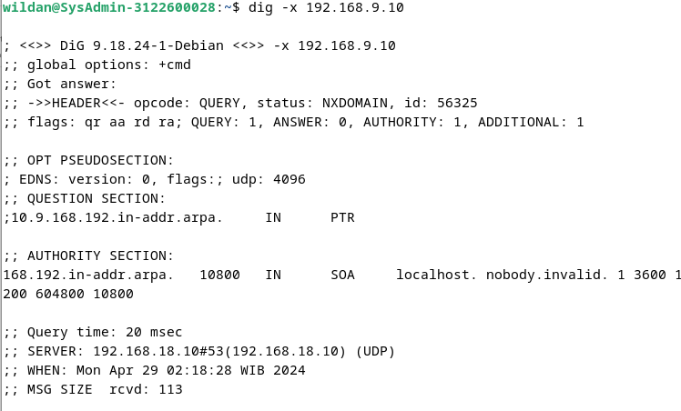

# SETUP DNS SERVER

* Langkah 1: Instalansi BIND9

1. Buka terminal
2. Update paket sistem:
   

3. install BIND9

* Langkah 2: Konfigurasi BIND9

1. Edit file /etc/bind/named.conf :

2. Edit file /etc/bind/named.conf.options :

3. Edit file /etc/bind/named.conf.local :

4. Edit file /var/lib/bind/db.kelompok9.local :

5. Edit file /var/lib/bind/db.kelompok9.local.inv :

6. Edit file /etc/resolv.conf :

* Langkah 4: Periksa Konfigurasi dan Restart BIND9

1. Periksa kesalahan konfigurasi:

2. Restart BIND9:

3. Periksa status BIND9 untuk memastikan tidak ada kesalahan:

4. Uji setup DNS

